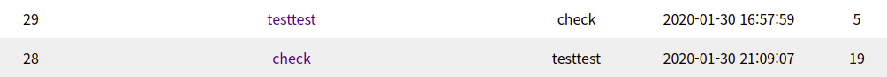
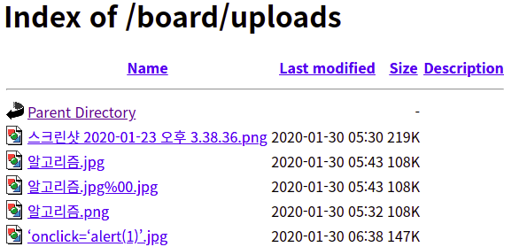
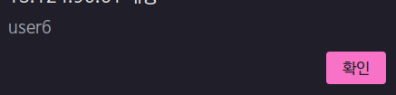
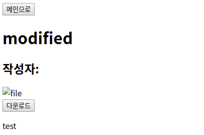

# Board Mini CTF (Day 1)

### 김ㄷㅎ
- 게시물 작성 시 XSS가 발생한다.


- 다른 사용자의 게시물을 수정 및 삭제할 수 있다.
- 세션이 존재하지 않아도 URL로 직접 게시물에 접근하여 게시물을 조작할 수 있다.

---

### 김ㅊㅅ
- 게시물 작성 시 XSS가 발생한다.


- 게시물 삭제 시 파라미터에서 글 번호를 조작해주면 다른 사용자의 게시물 삭제가 가능하다.
    - `number=(no)&id=(id)`


로그인 계정은 `testtest` 이다. 바로 아래 `testtest2`의 게시물을 삭제하기 위해 `testtest`의 게시물로 들어가 삭제 버튼을 누르고 프록시로 잡는다.

```http
GET /delete.php?number=34&id=testtest HTTP/1.1
```

사진에서 `testtest2`의 글 번호는 33으로, 글 번호에 해당하는 `number` 파라미터의 값을 바꿔주면 다른 게시물을 삭제할 수 있다.


---

### 이ㅅ
- ID와 PW 없이 로그인이 가능하다.
- 게시물 작성 시 제목과 내용에서 XSS가 발생한다.


---

### 이ㅈㅇ
- 게시물 삭제 시 파라미터에 작성자를 로그인한 ID로 지정하고 글 번호를 조작하면 다른 사용자의 게시물 삭제가 가능하다. 댓글은 수정과 삭제 모두 가능하다.
    - 게시물: `number=(no)&id=(id)`
    - 댓글: `number=(no)&commentnumber=(no)&id=(id)`



로그인 계정은 `testtest` 이다. 바로 위 `check`의 게시물을 지우기 위해 자신의 계정이 작성한 게시물로 들어가 삭제나 수정 버튼을 누르고 프록시로 잡는다.

```http
GET /delete.php?number=60&id=testtest HTTP/1.1
```

삭제할 게시물의 번호는 61로, 글 번호에 해당하는 `number` 파라미터의 값을 바꿔주면 다른 사용자의 게시물이 삭제되는 것을 확인할 수 있다. 댓글도 같은 방식으로 수정 및 삭제가 가능하다.


- 게시물 제목과 내용, 댓글에서 XSS가 발생한다.


---

### 익명
- ID와 PW 없이 로그인이 가능하고, 세션이 없어도 정상적으로 작업이 가능하다.
- 게시물과 댓글을 작성할 때 입력한 내용이 그대로 출력되기 때문에 XSS가 발생한다.


- 게시물 삭제 시 파라미터에 작성자를 로그인한 ID로 지정하고 글 번호를 조작하면 다른 사용자의 게시물과 댓글 삭제가 가능하다.
    - 게시물: `board_num=(no)&board_writer=(id)`
    - 댓글: `comment_num=(no)&comment_writer=(id)`

로그인 계정은 `admin` 이다. 삭제할 게시물로 들어가 삭제 버튼을 누르고 프록시로 잡는다.

```http
POST /board/board_delete.php HTTP/1.1
...
board_num=108&board_writer=
```

삭제할 게시물의 정보를 확인할 수 있다. 작성자에 해당하는 `board_writer` 파라미터에 로그인 계정인 `admin`을 넣어주면 삭제가 가능하다. 댓글도 같은 방식으로 삭제가 가능하다.


- 게시판 폴더 위치로 접속하면 디렉토리가 노출되는 Directory Listing 취약점이 존재한다. `/board/uploads` 위치에는 업로드된 파일을 확인할 수 있다. PHP 파일은 확장자 제한으로 인해 업로드가 불가능했다.



---

### 조ㅅㅁ
- 루트 위치로 접속하면 디렉토리 구조가 노출되는 Directory Listing 취약점이 존재한다.


- 게시물 제목에 스크립트 태그를 입력하면 해당 게시물을 출력할 때 제목이 출력되면서 스크립트가 삽입되어 XSS가 발생한다.




---

### 황ㅈㅇ
- ID와 PW 없이 로그인이 가능하다.
- 업로드한 파일이 저장되는 `file` 디렉토리가 노출되어 파일이 실행된다.(Directory Listing)


- 게시물 수정 시 URL의 글 번호에 해당하는 `id` 파라미터를 조작하여 다른 사용자의 게시물 수정이 가능하다.


`testtest` 계정으로 로그인하여 수정 버튼이 존재하지 않는다. 일단 해당 계정이 작성한 게시물로 이동하여 수정 버튼을 누르고 프록시로 잡는다.

```http
GET /myhome/modify.php?id=46&t=testtest&d=test&a=testtest HTTP/1.1
```

상당히 많은 값이 전달되는 것을 확인할 수 있다. 수정할 게시물의 번호는 9로, 글 번호에 해당하는 `id` 파라미터를 바꿔주고 요청을 보내 게시물 수정 페이지로 이동한다. 그리고 내용을 변경하고 버튼을 누른다.

```http
GET /myhome/modifyapply.php?where=post&id=9&title=modified&desc=test HTTP/1.1
```

그러면 위와 같이 요청이 전송되어 다른 사용자의 게시물이 수정되는 것을 확인할 수 있다.



- 파일을 업로드하면 `` 태그로 출력되는데, 파일명으로 `src` 속성을 닫고 XSS를 발생시킬 수 있다. 


게시물로 들어가 소스 코드를 보면 업로드 한 파일이 `` 태그로 출력되는 모습을 확인할 수 있다. 스크립트를 삽입할 수 있도록 파일명을 조작하여 업로드를 시도한다.


하지만 따옴표가 URL 인코딩되기 때문에 업로드 할 때 프록시로 잡고 파라미터를 수정해야 한다.


그러면 다음과 같이 XSS가 발생하는 것을 확인할 수 있다.


