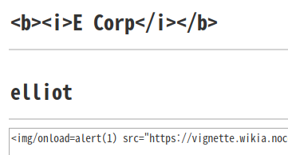
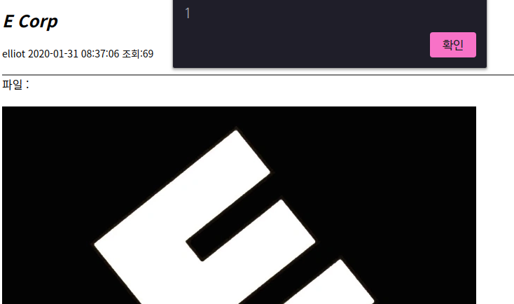
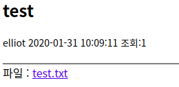
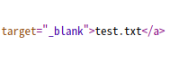
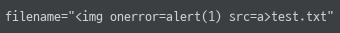
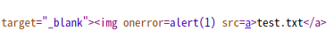
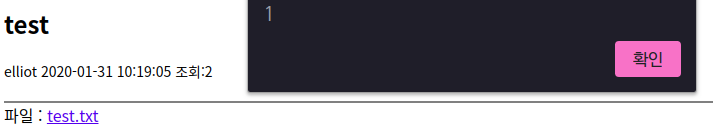
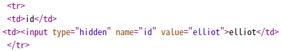
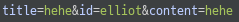

# Board Mini CTF (Day 2)

## 김ㄷㅎ
### XSS - Case 1
기본적으로 태그가 필터링되는 것처럼 보였지만, 삽입한 태그가 정상적으로 작동하는 제한적인 상황을 확인하고 스크립트를 실행할 수 있는 방법을 찾다가 XSS를 발생시킬 수 있는 페이로드를 발견하였다.

```html

```





### XSS - Case 2
파일명 조작으로도 XSS를 발생시킬 수 있다는 것을 경험해봐서 이번에도 시도해보기로 했다.




게시물을 다운로드 할 수 있는 링크에 파일명이 출력되는 모습을 볼 수 있는데, 파일명이 필터링되지 않는다면 태그 삽입이 가능할 것으로 보였다.



파일을 첨부하고 게시물 등록 요청을 한 후에 프록시로 잡아 파일명에 해당하는 `filename` 파라미터를 조작하여 페이로드를 입력하고 요청을 보냈다.




태그가 정상적으로 삽입되어 게시물을 확인할 때 XSS가 발생하는 것을 확인할 수 있었다.

---

## 이ㅈㅇ
### XSS



글 작성 시 `<hidden>` 태그에 `id` 값을 전달하는 것을 보고 파라미터를 조작하여 태그를 삽입할 수 있을 것 같아서 시도해봤더니 필터링 없이 게시물 작성자 ID로 등록할 수 있었다. 하지만 구문에 따라 오류가 발생해서 확인해보니 20자 제한이 있었다.

```html
<svg/onload=alert``>
```

20자 이내의 짧은 페이로드를 검색하다가 위와 같은 페이로드를 발견할 수 있었다. ID에 해당하는 `id` 파라미터에 페이로드를 입력하고 요청을 보냈다.


태그가 정상적으로 삽입되어 게시물 목록을 확인할 때 XSS가 발생하는 것을 확인할 수 있었다.