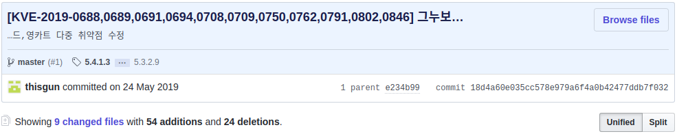
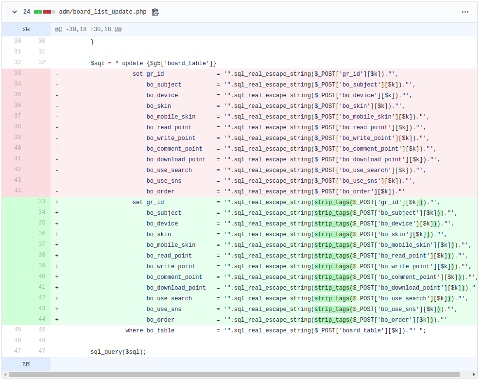
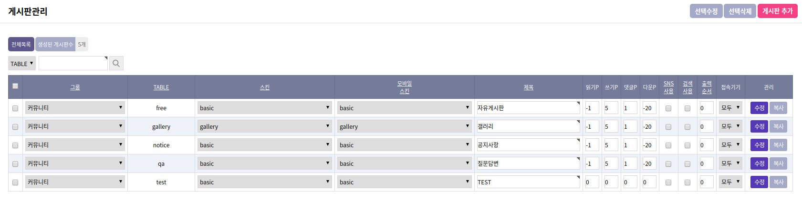
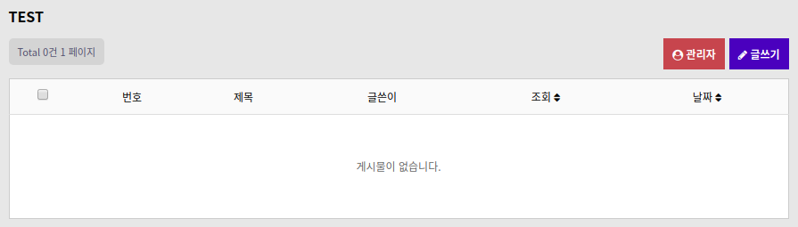
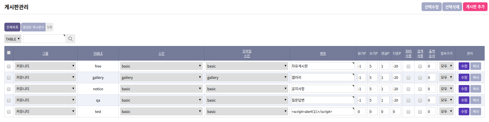
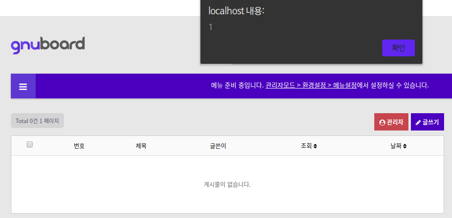
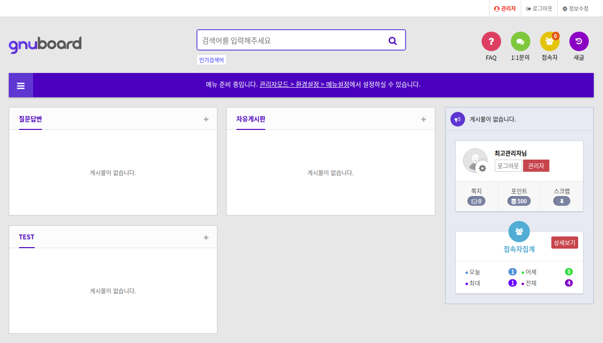

# KVE-2019-0688, 0689, etc.

**[gnuboard 1-Day]**

_(해당 취약점은 본인이 찾은 것이 아니며, 이미 제보된 취약점을 공부를 위해 분석한 것임을 알립니다.)_

https://github.com/gnuboard/gnuboard5/commit/18d4a60e035cc578e979a6f4a0b42477ddb7f032

이번 글에서는 다중 취약점 패치 중에서 `board_list_update.php` 파일을 분석해봤습니다.

`board_list_update.php` 파일은 `board_list.php` 파일로부터 넘겨 받은 값을 통해 게시판 목록을 수정하는 역할을 합니다. 패치에서 `strip_tags()` 함수가 추가된 것을 확인할 수 있는데, 이는 XSS 방지를 위한 대응으로 보여집니다.

우선 아래와 같이 임의로 게시판을 하나 생성해봤습니다. 제목에 입력한 내용이 그대로 출력되는 것을 확인할 수 있습니다.

패치 전에는 게시판 제목에 해당하는 `bo_subject` 변수에 스크립트 태그를 입력하면 그대로 게시판 제목으로 저장되어 아래와 같이 XSS가 발생하게 됩니다.

하지만 메인 페이지에서는 아래 사진에서 볼 수 있듯이 내용이 변경되지 않습니다. 이와 관련하여 몇 가지 테스트를 진행해본 결과, `board_list.php` 페이지에서 우측 상단에 있는 '선택수정' 버튼을 눌러 수정을 하면 메인 페이지에 출력되는 게시판 제목이 초기값 그대로 유지되지만, '선택삭제' 버튼을 눌러 다른 게시판을 삭제하면 제목 입력창에 입력된 값으로 게시판 제목이 변경되는 것을 확인할 수 있었습니다.

그렇기 때문에 다른 게시판을 삭제하지 않는다면, 정상적인 게시판으로 보이게 하여 다른 사용자를 XSS 공격에 노출시킬 수 있습니다.