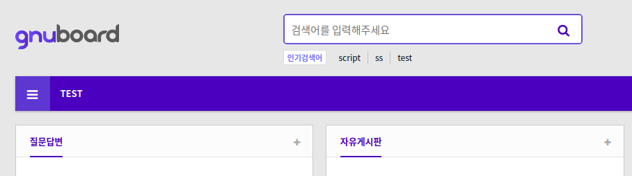

# KVE-2019-0789, 0821, 0860

**[gnuboard 1-Day]**

_(해당 취약점은 본인이 찾은 것이 아니며, 이미 제보된 취약점을 공부를 위해 분석한 것임을 알립니다.)_

_(플러그인에 대한 취약점 분석은 제외하였습니다.)_

https://github.com/gnuboard/gnuboard5/commit/630e39de16e61d6e0cc224028d20efb782436fba


우선 `menu_list.php` 파일과 `menu_list_update.php` 파일에 대한 내용입니다. 이 취약점은 메뉴 설정 시 발생하는 XSS 취약점입니다. 패치에서는 `strip_tags()` 함수가 추가된 것을 확인할 수 있는데, 이 함수는 문자열에서 HTML 태그와 PHP 태그를 제거하는 역할을 합니다.

아래 사진과 같이 설정에서 메뉴를 등록하면 설정한 이름 그대로 메인 페이지에 출력되는 것을 볼 수 있습니다.




패치 전에는 메뉴 이름을 의미하는 변수인 `$me_name`에 `strip_tags()` 함수를 사용하지 않았기 때문에 메뉴 이름에 스크립트 태그를 삽입하면 메인 페이지에 접근할 때 아래와 같이 XSS가 발생합니다.


`menu_list.php` 파일에는 `get_sanitize_input()` 함수가 추가되었는데, 이는 `admin.lib.php` 파일에서 확인할 수 있습니다. 코드에서와 같이 해당 함수도 `strip_tags()` 함수를 사용하여 XSS를 방지하는 역할을 합니다.

```php
function get_sanitize_input($s, $is_html=false){
    if(!$is_html){
        $s = strip_tags($s);
    }
    $s = htmlspecialchars($s, ENT_QUOTES, 'utf-8');
    return $s;
}
```

메뉴를 설정했을 때, 입력창에 필터링 된 값이 노출될 수 있도록 하기 위한 것으로 보여집니다.

---

`config_form_update.php` 파일은 분석만 간단히 진행하였습니다. 이 파일에서는 `$check_keys` 배열에 값들이 추가된 것을 확인할 수 있습니다.


기본 환경설정을 진행하는 페이지인 `config_form.php` 파일에서는 SNS 관련 기능을 사용하기 위한 API Key를 입력하는 폼이 존재합니다. 여기서 입력한 값들이 `config_form_update.php` 파일로 전달되어 처리되는 구조입니다.

```php
$check_keys = array('cf_lg_mid', 'cf_lg_mert_key', 'cf_cert_kcb_cd', 'cf_cert_kcp_cd', 'cf_editor', 'cf_recaptcha_site_key', 'cf_recaptcha_secret_key', 'cf_naver_clientid', 'cf_naver_secret', 'cf_facebook_appid', 'cf_facebook_secret', 'cf_twitter_key', 'cf_twitter_secret', 'cf_google_clientid', 'cf_google_secret', 'cf_googl_shorturl_apikey', 'cf_kakao_rest_key', 'cf_kakao_client_secret', 'cf_kakao_js_apikey', 'cf_payco_clientid', 'cf_payco_secret');

foreach( $check_keys as $key ){
    if ( isset($_POST[$key]) && $_POST[$key] ){
        $_POST[$key] = preg_replace('/[^a-z0-9_\-]/i', '', $_POST[$key]);
    }
}
```

위의 코드를 보면 foreach 문에서는 전달받은 API Key 값들을 필터링합니다. 해당 패치 이전에 패치된 내용([Link](https://github.com/gnuboard/gnuboard5/commit/40508b05d0e95d84cc0a9668eb810b36940db87e))을 보면 위의 foreach 문이 추가된 것을 확인할 수 있습니다. 테스트를 진행한 버전(5.3.2.0)에서는 위의 코드가 존재하지 않는데, API Key 값을 조작하여 공격할 수 있는 방법이 존재하기 때문에 패치를 진행하였을 것으로 생각됩니다. 또한 이번에 분석한 패치에서 `$check_keys` 배열에 값이 추가된 것은 누락된 API Key 값을 필터링하기 위한 것으로 생각됩니다.