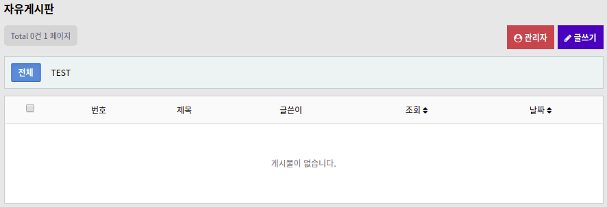
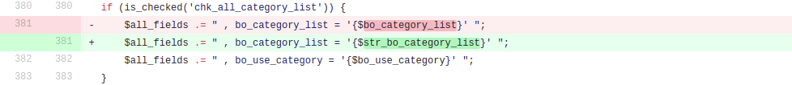
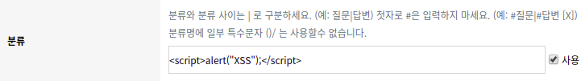

# KVE-2019-1508

**[gnuboard 1-Day] XSS 취약점**

_(해당 취약점은 본인이 찾은 것이 아니며, 이미 제보된 취약점을 공부를 위해 분석한 것임을 알립니다.)_

https://github.com/gnuboard/gnuboard5/commit/6016db4a9512902096c9e9f5fc9354e10d25628c

이 취약점은 게시판 생성 및 수정 시 발생하는 취약점입니다. 패치된 파일을 보면 아래 사진의 페이지인 `board_form.php` 파일에서 요청을 보내면 `board_form_update.php` 파일이 처리하는 것을 알 수 있습니다.

패치에서 수정된 변수인 `$bo_category_list`를 `board_form.php` 파일에서 찾아보면 게시판의 분류를 입력하는 부분에 해당됩니다.

분류에 'TEST'라는 값을 입력하고 해당 게시판에 들어가보면 아래 사진과 같이 입력한 내용이 분류 탭에 그대로 출력되는 것을 확인할 수 있습니다. 이 부분에서 스크립트 태그가 입력된다면 게시판에 접속할 때 XSS가 발생할 것으로 예상하였습니다.

하지만 XSS를 발생시킬 수 있는 스크립트를 입력해보면 패치된 코드의 첫 번째 부분에서 볼 수 있듯이 `board_form_update.php` 파일의 `preg_replace()` 함수로 인해 명시되어 있는 특수문자들이 제거되고, 아래 사진과 같이 저장되어 XSS가 발생하지 않습니다.

이쯤에서 패치된 부분의 코드를 봤을 때, 변수를 `$bo_category_list`와 `$str_bo_category_list`로 구분한 이유가 궁금했습니다. 그래서 패치되기 이전의 코드를 기준으로 두 변수가 사용되는 부분의 흐름을 확인해봤습니다.

우선 패치된 첫 번째 부분의 코드를 보면 분류에 입력된 값이 `$bo_category_list`에 할당되고, 그 값이 조건 연산자를 거쳐 `$str_bo_category_list`에 할당됩니다. 그 다음 사진에서 생략된 아래 부분의 코드를 보면 `$sql_common` 이라는 변수에서 `$str_bo_category_list`의 값을 이용하여 INSERT 쿼리를 전송하게 됩니다.

패치된 두 번째와 세 번째 부분의 코드는 분류 우측에 있는 체크박스가 체크되었을 때 작동하게 됩니다. 각각 그룹과 전체 게시판에 해당 설정을 저장하는 역할을 합니다. 만약 체크가 되면 `$bo_category_list`의 값이 각각 `$grp_fields`와 `$all_fields` 변수에 저장되어 UPDATE 쿼리를 전송하게 됩니다.

여기서 문제가 발생한다는 것을 깨달았습니다. 분류에 XSS를 발생시킬 수 있는 스크립트를 입력하면 `$bo_category_list`에는 입력한 내용 그대로 할당되지만, `$str_bo_category_list`에는 `preg_replace()` 함수를 거쳐 특수문자들이 제거된 내용이 할당됩니다. 그래서 우측의 그룹적용이나 전체적용 체크박스를 체크하고 게시판을 생성하거나 수정하면 `$bo_category_list`의 내용이 저장되어 아래 사진과 같이 스크립트 태그를 문제 없이 삽입할 수 있습니다.

그렇게 생성되거나 수정된 게시판에 접근할 때 XSS가 발생하는 것을 확인할 수 있었습니다. 입력한 분류가 그룹이나 전체 게시판에 적용되기 때문에 다른 게시판에서도 XSS가 발생하게 됩니다.

패치에서는 그룹적용이나 전체적용을 선택했을 때에도 특수문자가 제거된 `$str_bo_category_list`의 내용을 저장하도록 하여 XSS를 방지하는 것으로 보여집니다.